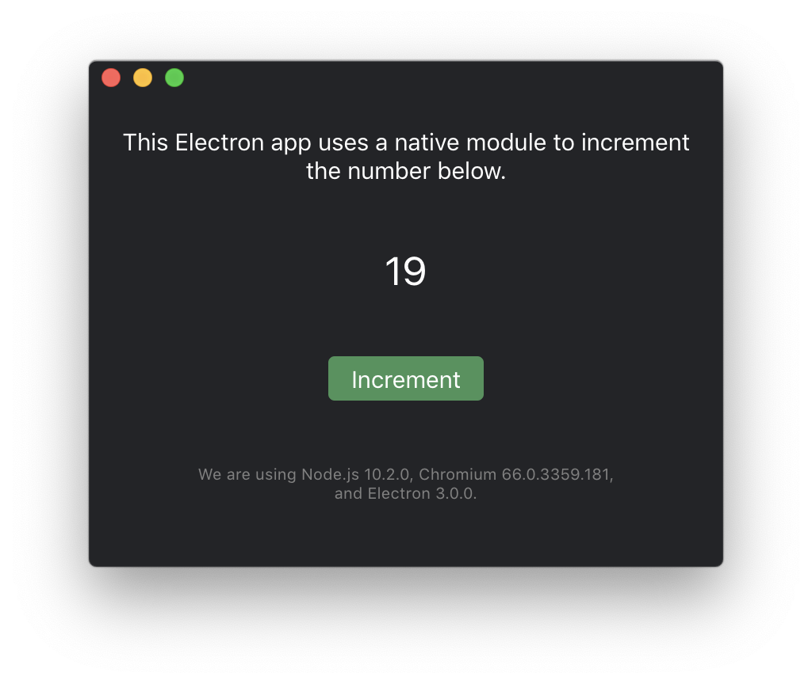

# Native Module Electron

  

This example is used in our article on [Running Native Code in Electron](https://pspdfkit.com/blog/2018/running-native-code-in-electron-and-the-case-for-webassembly) and contains two npm packages:

1. [`native-increment`], a native addon, which will expose a function that increases a number by one.
2. [`electron-app`], an [Electron](https://electronjs.org/) application that will use the native addon to increment numbers.

## Prerequisites

* [Node.js](http://nodejs.org/) (with npm or Yarn)

## Getting Started

Please check out [Running Native Code in Electron](https://pspdfkit.com/blog/2018/running-native-code-in-electron-and-the-case-for-webassembly) for an in-depth explanation.

### Contributing

Please ensure
[you have signed our CLA](https://pspdfkit.com/guides/web/current/miscellaneous/contributing/) so that we can
accept your contributions.

[`native-increment`]: https://github.com/PSPDFKit-labs/native-module-electron/tree/master/native-increment
[`electron-app`]: https://github.com/PSPDFKit-labs/native-module-electron/tree/master/electron-app
